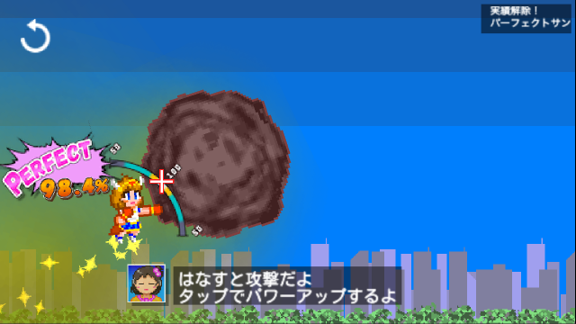

## あそびかた How to Play
ステップは3つ！

1. 命中バーの中央を狙って長押し
1. なるべくギリギリで離す
1. 連打でパワーアップ！

### もうすこし くわしく
ゲームを初めて起動したときは設定画面が表示されます。 
必要に応じて言語やオーディオ項目を選択してください。

その後、左上のBackボタンを押して設定画面から抜けてください。

1. タイトル画面で**PLAYボタンを押します**。ゲームプレイ画面へ切り替わります。
1. 命中バーが表示されたら、**画面を長押し（パソコンの場合はマウスのボタンを長押し）してください**。 桃子が拳を構えます。 
1. **指（ボタン）を離すと桃子が攻撃します**。 長時間構えると打撃がパワーアップします。ただし時間に上限があり、それを過ぎると攻撃失敗です。
1. 打撃が成功すると命中バーの動作が停止します。できるだけポインタがバーの中央にあるときを狙ってください。
1. 打撃が命中した後、少しの時間ですが、攻撃力の増幅が可能です（エミット）。 **画面（ボタン）を連打してパワーアップ**しましょう。 
1. エミット可能時間が過ぎると、隕石が吹き飛びます。桃子が宇宙へ隕石を運ぶまでしばらくお待ち下さい。
1. 最終的な飛距離が表示されます。これがあなたのスコアです。
1. Backボタン、Retryボタン、Tweetボタンが表示されます。ぜひ結果をシェアしたり、ゲームを再トライして高スコアを狙ってください！

## タイトル画面 Title

|メニュー|説明
|---|---
|ゲームをプレイ Play|ゲームをプレイします。
|設定 Settings|ゲームの設定を変更します。 一定の条件を満たさないと変更できない項目もあります。
|実績と記録 Achievement and Records|ゲーム内実績と各種記録を閲覧します。 実績解除あるいは記録のカウントが無い状態では詳細が表示されない項目もあります。
|ハッシュタグ検索 Hashtag Search|Twitterでハッシュタグ「#メテオ桃子だけど」（日本語以外では #MeteorMomoko）を検索します。
|ウェブページ Webpages|ゲームのトップページへ移動します。
|ゲームの遊び方 How to Play|ゲームのドキュメントを表示します。
|桃子 Momoko|桃子だけど。

## リリースノート Release Notes

|日付|概要
|---|---
|2019-11-06|First Release

## システム要件 System Requirements

|OS|ブラウザ
|---|---
|Windows|Google Chrome
|Mac|Google Chrome, Safari
|iOS|Google Chrome, Safari

※動作確認の取れているブラウザの一覧です。

|言語|備考
|--|--
|🇯🇵日本語|デフォルト
|🇺🇸英語|機械翻訳
|🇹🇼🇭🇰繁体中国語|機械翻訳、一部のみ対応
|🇰🇷韓国語|機械翻訳、一部のみ対応

※翻訳データの提供を歓迎しています。

## ゲームデータの保持方法 Storage
各種ゲームデータ（記録・実績・設定）は個別のブラウザに記録されています。 
ブラウザのデータを削除したり、別のブラウザを使用した場合はゲームデータが引き継がれません。 
ご了承ください。

## プライバシーポリシー Privacy
ウェブサイトの表示に必要なものを除き、ユーザの個人情報を取得・保存していません。

## オープンソース及びアセットのライセンス表記 Licenses
[GitHubリポジトリ](https://github.com/R-F-D/MeteorStriker)を参照してください。

