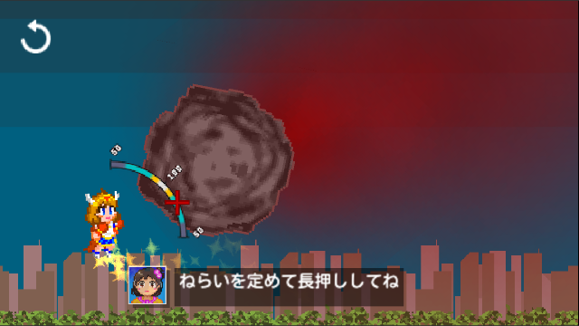
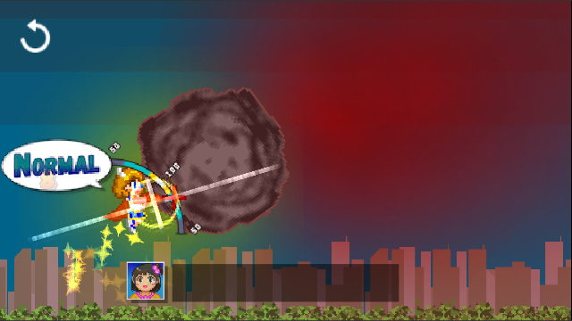
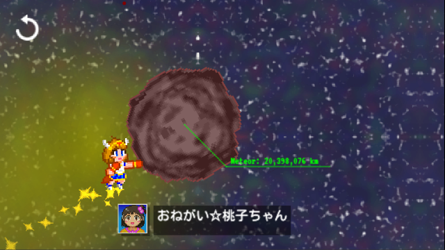
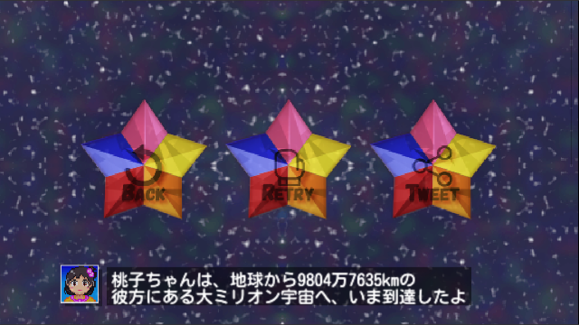
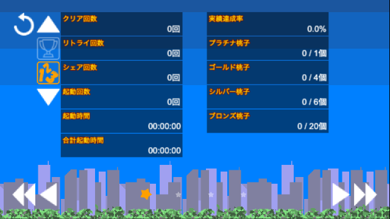
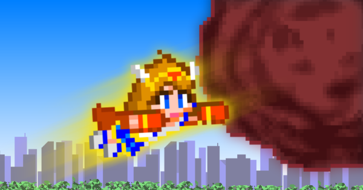

# プレス資料集
## 概要
「アイドルマスター ミリオンライブ！」シリーズを原作とした二次創作ゲーム。
その登場人物の1人、周防桃子（すおうももこ）を主人公としている。 
2017年5月にGREE版ミリオンライブで行われた「サイキックヒーローズガシャ」で登場したカード「地球の危機を救うため 周防桃子」「必殺のﾒﾃｵｽﾄﾗｲｸ! 周防桃子」が元ネタ。

## 連絡先
- R.F.D./温泉ねずみ ([@R_F_D](https://twitter.com/R_F_D))

## リンク
- [リリース告知ツイート](https://twitter.com/R_F_D/status/1192069223310188550)
[[英語](https://twitter.com/R_F_D/status/1192071297389350912)]
[[繁体中国語](https://twitter.com/R_F_D/status/1192073275184041984)]
[[韓国語](https://twitter.com/R_F_D/status/1192072616401485824)]
- [リザルトのシェアツイートのサンプル](https://twitter.com/R_F_D/status/1192069512733937664)

## 画像
### タイトル

### ゲームプレイ

### 実績と記録

### 設定

### その他

## 動画
- [開発中のタイトル画面](https://twitter.com/R_F_D/status/1158364928475983872)

